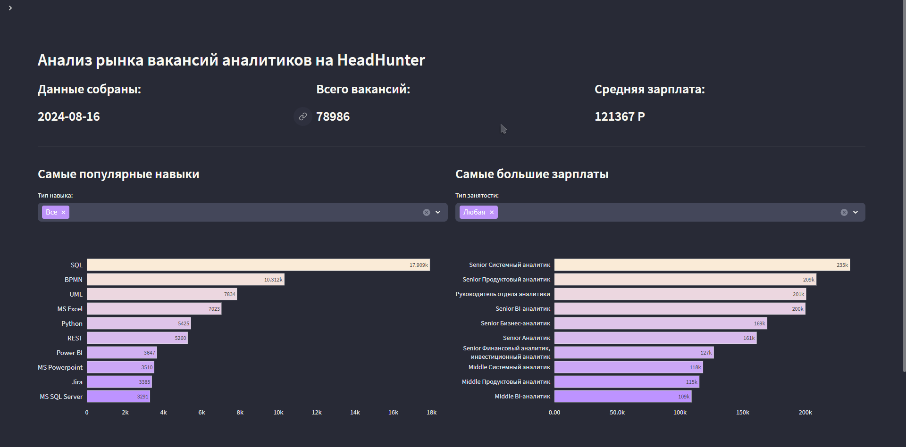
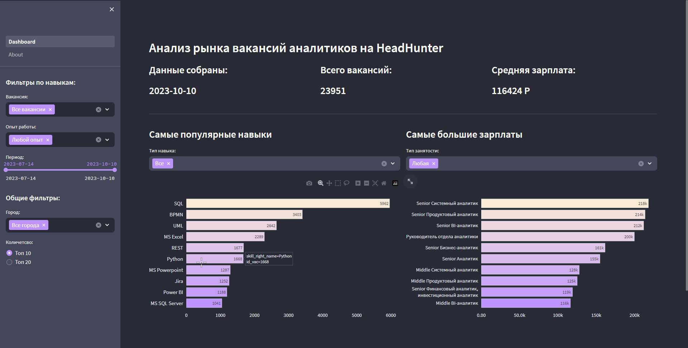

##  Проект по анализу рынка вакансий аналитиков на hh.ru

### UPD: 16.08.24 Сбор данных был остановлен, на сайт больше не зайти.

#### Вот как это выглядело в последний день работы:

#### Или в фортмате скриншота:

---

### Результат можно посмотреть [здесь](https://odk.analytics-app-hh.ru).

Мой проект, который я решил сделать, когда я начал искать работу аналитиком.

Я обнаружил, что на рынке представлено много раличных видов аналитиков, а компаниям требуется огромное количество технологий. 
Поэтому я решил собрать эту информацию в единый интерфейс, чтобы помочь другим людям решить, во что инвестировать свое время.

Этот проект был разработан с целью собрать большой объем данных о вакансиях аналитиков из [Headhunter](https://hh.ru), аггрегироваь их
и выяснить какие наавыки необходимы различным аналитикам, а также провести анализ зарплат.

---

### Весь проект докеризирован и состоит из следующих частей:
- База данных – PostgreSQL.
- ETL pipeline для ежедневного парсинга построен в Airflow.
- Веб приложение написано с помощью Streamlit.
- Обратный прокси сервер – Nginx Proxy Manager.
## [Сбор данных](airflow/dags/dag_parser.py) 

Данные собираись с помощью API hh.ru, выбирались все вакансии в названии которых было слово аналитик. Изначально данные были собраны за 30 дней(максимально возможное значение), теперь данные обновляются еждневно с помощью ETL пайплайна, каждый день делится на 4 части и данные собираются постепенно за каждую четверть дня(из-за ограничений API на выдачу). Помимо этого данные в пайплайне проходят предварительную обработку и загружаются в базу данных.

 ## [Очистка данных](airflow/dags/dag_parser.py) 

Обработка данных включает в себя форматирование данных в читаемый формат Pandas DataFrame. Обрабатываются зарплаты в зависимости от валюты и налога, если в зарплате указана вилка берется среднее значение. К каждой вакансии добавляются навыки, а также их тип и описания вакансии. Также удаляются вакансии не связанные с аналитикой данных.
 ## [Визуализация](app/01_Dashboard.py)

 Визуализация была сделана с помощью библиотеки Streamlit языка Python. Дашборд сосстоит из двух чартов. Один чарт с самыми востребоваными навыками, которые можно фильтровать по типам навыков, другой чарт с зарплатами аналитиков в зависимсоти от грейда. Помимо чартов на дашборде есть KPI со средней зарплатой и некоторая дополнительная информация (дата актуальности данных и сколько всего вакансий собрано). Данные на дашборде можно фильтровать различными способами. По типу аналитика, по времени, по географическому признаку и по опыту работы. 
